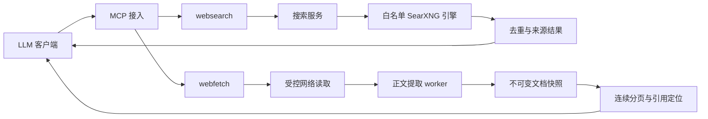

# Web Research MCP 设计

文档类型：设计参考。当前交付与实现进度见 [README](README.md)；本页定义目标行为，不代表运行能力已实现。

## 产品定位

向 LLM 提供两个可组合工具：`websearch` 发现公开网页，`webfetch` 读取其中一个网页。调用方负责提出查询、选择来源和生成回答；服务负责真实来源、内容提取、有限资源使用和失败语义。上游接入遵循用户确定的 [免费免 Key 规则](docs/06-upstream-policy.md)。

用户可自行运行一个 MCP 进程，连接自己管理的 SearXNG。初版服务不要求搜索账号，不内置推理模型，不上传检索记录到遥测平台，不承担全网索引建设。

## 两条核心路径

搜索支持 sites/域名范围，默认输出 URL、标题、摘要与相关性说明；显式 evidence_mode=extract 时按预算补抓前几条结果，输出可定位的原文片段和证据置信等级。搜索不隐式抓取全部结果。连续读取复用同一快照，刷新网页产生新观察记录；不同格式不共用字符偏移。域过滤、原文身份和评分语义见 [站点与证据设计](docs/12-sites-evidence-scoring.md)。

## 设计不变量

| 编号 | 要求 | 验证方式 |
| --- | --- | --- |
| INV-01 | 任一搜索路径都满足上游准入条件 | 配置拒绝测试、精确引擎记录和匿名 live smoke |
| INV-02 | 业务模块不依赖 MCP SDK，Provider 不处理 MCP envelope | 导入检查与独立业务集成测试 |
| INV-03 | 每次实际出网连接符合对应网络策略 | 验证禁止目标没有收到连接，而非只断言错误字符串 |
| INV-04 | empty、partial、error 和正常分页可明确区分 | 错误契约和 MCP 回放 |
| INV-05 | 返回的段落可定位到保留的完整快照 | hash、Unicode offsets、分页拼接与重启续读 |
| INV-06 | 超时、取消和关闭最终释放所有自有资源 | worker、socket、计时器、SQLite 连接的清理验证 |
| INV-07 | 模型可见内容是数据，不获得执行权限 | 恶意网页 fixture 与出网/本地文件副作用断言 |
| INV-08 | 发布入口只依赖本项目构建产物与声明依赖 | 干净安装目录下的 stdio smoke |
| INV-09 | sites 限制在候选返回和证据跳转时均成立 | 规范化 hostname、恶意后缀、IDNA 与越界目标未连接断言 |
| INV-10 | 原文、相关性和真假判断不混为一个分数 | quote 快照匹配、评分版本/依据、fact_probability=null |

## 技术与模块决策

采用单包、模块化 TypeScript 服务，显式传入依赖。搜索定义、Provider、Consumer 分开；只有出现独立部署、不同运行时或真实复用需求时才拆包。技术栈与版本策略由 [技术栈文档](docs/07-technology-stack.md) 维护，模块归属和资源生命周期由 [架构文档](docs/03-architecture.md) 维护。

运行控制分三层：固定准入与网络不变量；部署者可配置的资源上限；调用者可请求的结果数量和输出长度。工具参数可在部署上限以内收窄预算，不能提高部署上限或启用未批准引擎。

## 来源、持久化与输出

规范化 URL 对应 source_id；一次获取观察有 fetched_at、最终 URL 和响应状态；格式化文档有 snapshot_id、content_sha256 和稳定段落偏移。内容可以去重，观察时间不可被旧缓存伪装成新抓取时间。搜索结果快照与正文快照分别存储。

快照和续读状态以 SQLite 为唯一运行状态来源；JSONL 仅用于有界、可配置的诊断/回放记录，不能同时成为第二套业务状态。日志默认不保存完整查询或正文；本地显式评估录制在独立目录中保存脱敏输入和预期输出。保留的内容与元数据必须足以解释本次返回，超过保留期明确声明证据已不可取。

## 可用性与失败

启动读取并验证配置，不在模块 import 时出网。未配置搜索端点可启动 fetch-only 服务，并在 websearch 调用时返回 CONFIGURATION_REQUIRED；提供了非法配置则启动失败。所有上游失败时不能返回 empty。提取阶段失败不能用原始 HTML 冒充干净正文。

受控 HTTP 先满足静态网页。解析 HTML 属于可能阻塞的 CPU 工作，放在有界 worker 中，超时可终止 worker；单纯 AbortSignal 不足以中断同步解析。完整浏览器后备另列阶段，不因静态失败就自动启动用户浏览器。

## 交付与演进

实施顺序见 [路线与评估](docs/05-roadmap-evaluation.md)。M1 先打通两个工具和受控提取，M2 完成持久化与恢复，M3 做排序实验。M1 的工具发现和基础获取可作为阶段证据；重启续读只有 M2 完成后才属于已交付能力。

兼容性决策、依赖引入和数据格式变更进入 [ADR](docs/decisions/README.md)。开发流程见 [CONTRIBUTING](CONTRIBUTING.md)，编码规则见 [编码规范](docs/08-coding-standards.md)，验证分层见 [测试规范](docs/10-testing.md)。DeepSeek Harness 的借鉴范围及当前核查版本见 [参考记录](docs/references/deepseek-harness-practices.md)。
