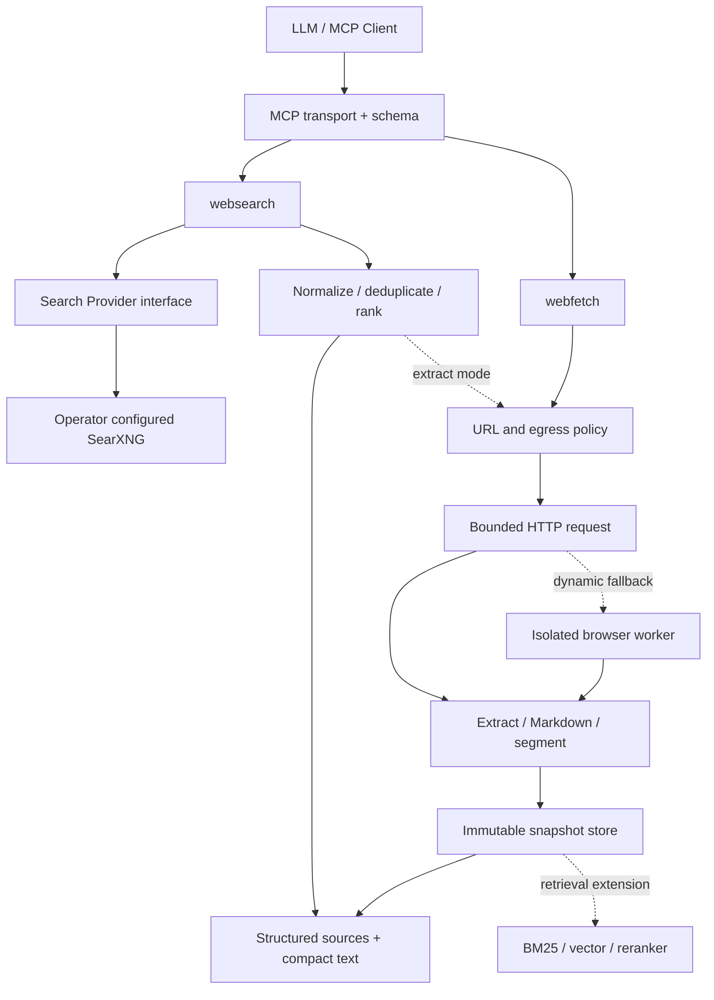

# 架构与运行机制

类型：实现参考。扩展模块的交付进度以 [README](../README.md) 为准；本页定义模块和运行行为。设计总览见 [DESIGN](../DESIGN.md)。

## 模块与调用路径

浏览器补抓必须经相同出网策略并回到提取器。静态 HTML 解析本身也在可终止的 worker 中执行；它不等于完整浏览器。扩展交付阶段由实施清单维护。

| 目录 | 职责 | 不应承担 |
| --- | --- | --- |
| src/mcp | SDK 注册、stdio/HTTP 传输、响应包装 | HTML 解析和排序 |
| src/tools | 工具编排、校验后的业务输入 | Provider 的网页选择器 |
| src/search | Provider 协议、SearXNG 映射、候选状态 | 最终答案生成 |
| src/fetch | URL 检查、连接、跳转、提取、分段 | 执行网页给出的工具指令 |
| src/ranking | URL 去重、RRF、可选精排 | 伪造缺失的上游名次 |
| src/storage | 快照、查询缓存、TTL、游标 | 改写历史快照 |
| src/shared | deadline、日志、错误与配置 | 与特定 LLM 厂商绑定 |

## 装配和依赖方向

唯一运行入口 mcp/stdio 装配配置、网络客户端、搜索 Provider、提取 worker 和存储，然后注册两个工具。业务编排通过构造参数接收接口，资源生命周期归装配根所有。无自动模块扫描、全局容器或 import 副作用。

允许的运行依赖方向：普通 mcp 模块 → tools/shared；tools → search/fetch/ranking/storage/shared；search、fetch、ranking、storage → shared。唯一装配根 mcp/stdio.ts 是明确例外，可以导入上述模块的公开工厂、类型与生命周期接口来构造和销毁资源，不可直接操作内部状态。领域模块不反向导入 tools 或 mcp，也不横向绕过接口操作另一个模块的内部资源。search/types、fetch/types、storage/types 等在模块内部声明，tools 组合这些接口；代码共享仅在确实具有共同语义时下沉 shared。

MCP SDK 导入只在 mcp 与协议测试中出现；公开网页的 Undici/DNS 连接封装集中于 fetch/network；search/searxng 使用独立、禁重定向、限定操作员端点的 Node HTTP 客户端，作为不同信任目标的窄例外。check:boundaries 检查这些导入位置，禁止通过动态导入规避规则。

Request 是来源校验后的输入，Spec 是 resolve 后包含默认值与有效上限的只读执行参数。deadline 使用单调时钟计算剩余时长，记录抓取时间使用 UTC 墙钟。所有可变阈值在配置解析时合并，执行层不得藏有另一套默认值。

## Search Provider 契约

设计为 `search(request, signal) -> ProviderResult`。ProviderResult 包含候选及其 source/provider、rank、query_variant、上游状态、能力声明。把 time_range、domain filter、language 的实际支持情况写入 capabilities；不支持的约束必须报告，不能静默假装执行成功。

SearXNG 地址由操作员配置，不能由工具参数任意替换。初版只支持一个配置好的实例；未配置时 `websearch` 返回 CONFIGURATION_REQUIRED，`webfetch` 仍可独立使用。公共实例不作为隐含默认值。

上游准入是服务级硬约束：主路径和降级路径都只能使用公开、匿名、免注册、免 Key、无付费要求的搜索来源。适配器声明 access_mode、requires_account、requires_api_key、requires_payment；未声明或不符合准入则不可启用。调用方不能用工具参数放宽策略。SearXNG 部署配置和请求 engines 参数共同限定已检查的精确引擎清单，配置更新后重新核查；不能仅凭 MCP 到 SearXNG 不带 Key 就断言整个链路免 Key。

对 `unresponsive_engines` 等上游信息保留诊断映射。请求 HTTP 200 但全部引擎失败时算失败；部分失败但返回有用结果时算 partial；成功执行查询而零命中才是 empty。[API](https://docs.searxng.org/dev/search_api.html)

## 站点限定与证据编排

tools/websearch 的 resolve 生成不可变 DomainScope 和 EvidenceSpec。候选进入去重/输出前通过域范围检查；证据路径把同一 scope 传给 fetch，使每个跳转目标在建连前接受检查。域范围检查是独立于公网安全的额外限制，既不能放宽网络策略，也不能被 query 中的 site 语法覆盖。

域规范化与纯匹配逻辑放 shared/domain-scope，搜索查询改写归 search，补抓编排归 tools/evidence，词法匹配和证据片段选择归 ranking。tools 编排依次调用已有 fetch、ranking 和 storage 接口，不在 search Provider 中直接抓网页，也不嵌套调用 MCP 工具。

none 模式只发现网页；extract 模式对前 N 条按受控并发获取 text 快照，选择连续原文、校验定位、建立快照读 cursor，再计算片段相关性和置信等级。所有阶段共享对应模式的总 deadline；未完成证据用逐结果状态表示。正文失败时仍保留合法 SERP 结果，整体状态按目标结果完成情况归一化。详细状态和字段归 [站点与证据设计](12-sites-evidence-scoring.md)。

## Fetch 管线

1. 解析 http/https URL；拒绝 credentials、危险端口和非公网目标。
2. DNS 解析与建连使用同一受控策略，检查 IPv4、IPv6、映射地址及每次重定向；不只检查最初 URL。
3. 检查 robots 策略并缓存规则，使用明确 User-Agent。按域限制并发，尊重 Retry-After。
4. 在总 deadline 内读取，限制压缩前后体积；按媒体类型路由。
5. HTML 用 Readability 等提取器，保持标题、链接、代码和表格；纯文本与 Markdown 保持原义。复杂文档必要时用经过测试的后备提取器。
6. 清除可执行内容、危险链接协议；质量不足返回 extraction warning 或失败。
7. 生成规范化内容哈希、快照和段落 ID，按预算展示。

静态解析采用受限 worker，限制并发、HTML 深度、输入大小和执行时间。父进程在超时/取消时终止 worker 并等待退出；worker 不具备网络客户端或用户凭据。无可用正文时返回 EXTRACTION_FAILED，不退回未经提取的原始 HTML。

普通 webfetch 允许重新验证后的公开跨域跳转；HTTPS → HTTP 降级拒绝。搜索服务端点只允许配置的精确 origin，任何重定向均拒绝，防止请求被导向未审核服务。上游 HTTP 状态在内部保留；非 2xx 读取不能作为成功正文，429 映射 RATE_LIMITED，其他失败映射 HTTP_ERROR。

浏览器后备延后实现：单独上下文、不读取用户浏览器 Cookie，所有子请求、WebSocket、重定向也受出网策略控制。单纯路由拦截不能解决 DNS 重绑定，需要受控代理或网络层限制。抓取系统的 SSRF 风险见 [OWASP](https://owasp.org/www-community/attacks/Server_Side_Request_Forgery)。

本地 SearXNG 是操作员选定的受信服务端点，允许精确配置的 loopback host/port；这一例外不能用于任意 `webfetch` URL，也不能扩展为允许整个私网。

## 内容和缓存

- 查询缓存键：query + language + time_range + 规范化 DomainScope + evidence 参数 + Provider/词法评分/提取策略版本；正文证据另指向不可变快照，不缓存指向已过期快照的“verified”结果。
- 搜索缓存与正文快照分开；刷新只产生新快照，不覆盖旧内容。
- source_id：保守规范化 URL 的稳定哈希；不删除可能影响语义的 query 参数，不随意合并 http/https 或尾斜线。
- snapshot_id：绑定 source_id、观察记录 ID、输出 format、提取器/序列化器版本和完整输出内容 SHA-256；同一字节内容可共享 blob。fetched_at 属于实际获取观察记录，重新抓取的观察时间不能被内容去重覆盖。
- 快照段落 ID 和游标在有效期内稳定；游标绑定 snapshot、偏移、显示选项和有效期。
- 游标保存于服务端映射，或签名防篡改；过期明确报错，不重新抓网页后继续旧偏移。
- 缓存失败仅短期保存，不能把挑战页保存为正文；stale 命中必须披露。
- 后续远程服务按租户隔离快照、缓存和游标。Provider 的存储约束可覆盖默认 TTL。

快照在一种确定输出格式上计算 Unicode code point offsets；markdown 和 text 使用不同快照/游标，不在续读时转换格式。每条观察记录保存请求 URL、最终 URL、HTTP 状态、抓取时间和提取版本，格式化快照保存 full content、hash、segments 和 expires_at。SQL 事务提交成功后才返回可续读 cursor。

SQLite 当前使用带 kind/id/payload/expiry 的 records 表保存快照、冻结搜索池、页面响应和游标；PRAGMA user_version 标识格式版本。观察身份位于快照记录中；全文索引与独立 blob 去重表尚未加入。所有查询参数化，短事务内只做存储操作。WAL 模式仍有单写者约束；大语料索引不阻塞 MCP 主循环。

存储配置包含磁盘上限与快照有效期。先回收过期且无引用的 blob，仍不足则拒绝新快照并返回 STORAGE_UNAVAILABLE；不静默驱逐尚承诺有效的 cursor。本版本直接实现 SQLite SnapshotStore，重启恢复已有真实数据库测试；不提供另一套内存生产存储。schema_version 不兼容明确报错，不自动清空数据。

## 生命周期与审计

请求的步骤为 received → validated → resolved → executing → completed/failed/cancelled；每个请求最多一个终态。多个阶段或 Provider 的结果分别记录，不用一个布尔 success 覆盖 HTTP 状态、超时与正文完整性。

process 关停停止接收新请求，取消在途 I/O，终止并等待提取 worker，关闭 dispatcher，最后 flush 有界诊断并关闭数据库；关停耗尽预算时记录未完成清理并以失败状态退出。操作系统 DNS 查询可能无法直接取消，迟到结果必须丢弃，不创建新连接。

运行状态以 SQLite SnapshotStore 为准。默认 stderr 元数据不包含完整 query 或正文。显式开启测试录制才写入隔离的 transcript/网络 fixture，并做脱敏和保留期控制；不能把“模型可见结果可复核”解释为永久保存所有用户内容。

## 运行控制（初始实验参数）

搜索总 deadline 15 秒，单上游 8 秒；静态 fetch 20 秒；单域并发 2；最大重定向 5；最大解压正文 5 MiB。搜索返回默认 8 条、最多 20 条；fetch 默认输出 12,000 Unicode code points、最大 50,000。仅为可配置起点，不能当作性能指标。

上述 15 秒用于 none 模式；extract 模式初始总预算为 45 秒，覆盖搜索与补抓，不能给每个结果额外完整预算。证据结果数和段落预算由 search.evidence 配置，硬上限由 Schema 和部署策略共同限定。

有限重试只用于可恢复错误，并计入同一总 deadline；对挑战页、明确拒绝和永久错误不循环重试。Provider 熔断后定时半开探测。所有请求受全局并发限制；调用取消要中止实际网络读取。

日志写 stderr，只记录 request_id、阶段耗时、错误码、缓存状态；查询正文和含凭据/敏感 query 参数的 URL 默认脱敏。抓取内容是外部数据，不获得额外权限；不因页面提示而读取本机文件、Key 或向外发送数据。
